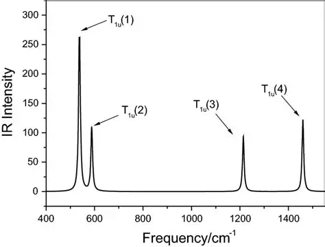
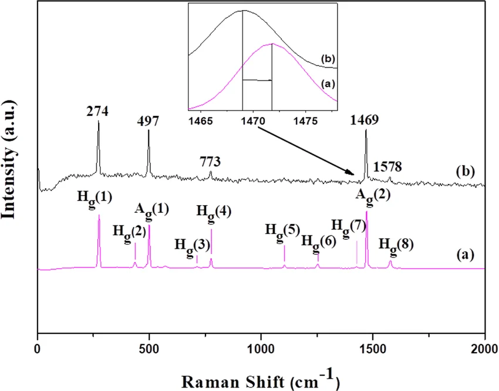

# Character Calculator — CLI 使用手册

## 概要

```bash
> python main.py                                         # 交互模式（向后兼容）
> python main.py --help                                  # 显示帮助
> python main.py list                                    # 列出所有点群
> python main.py verify --all                            # 验证所有点群
> python main.py verify [group]                          # 验证指定点群
> python main.py -g GROUP IR                             # 红外活性
> python main.py -g GROUP Raman                          # 拉曼活性
> python main.py -g GROUP table                          # 显示特征标表
> python main.py -g GROUP verify                         # 验证该群
> python main.py -g GROUP "expression"                   # 算式求值
> python main.py -g GROUP vib [N1 N2 ...]                # 振动模式分析
> python main.py storage --group GROUP list              # 列出已存储特征标
```

---

## 算式表达式语法

```
表达式    → 和式 (ARROW 名称)?
和式      → 积式 (("+" | "⊕") 积式)*
积式      → 因子 (("⊗" | "x" | "*") 因子)*
因子      → 函数 | "[" 特征标源 "]"
函数      → "Sym^" n "( 表达式 )"
         → "Alt^" n "( 表达式 )"
         → "Pow^" n "( 表达式 )"
         → "gPow^" n "( 表达式 )"
         → "Y(" 数字/字母 ")"
         → "Poly(" n ")" | "P(" n ")"
特征标源  → 数值列表 | 标识符
ARROW     → "->"
```

运算符优先级（低 → 高）： $\oplus$  / $+$（直和）< $\otimes$ / $\times$ / $*$（张量积）< 函数 / 原子

### 特征标引用

所有特征标引用**必须**用 `[...]` 包裹：

| 格式 | 示例 | 说明 |
|------|------|------|
| `[T1u]`, `[A1g]`, `[E]` | 不可约表示名 | 大小写敏感，需与数据库一致 |
| `[Vec]`, `[V]` | 向量表示 | 3D 向量表示的特征标 |
| `[3, 0, -1, 1]` | 手动输入 | 逗号分隔，类数必须匹配 |
| `[$my_char]` | 已存储特征标 | `$` + 名称 |

### 函数

| 函数 | 示例 | 数学含义 |
|------|------|----------|
| `Sym^n(expr)` | `Sym^3([T1u])` | $\text{Sym}^n(\chi)$ |
| `Alt^n(expr)` | `Alt^3([T1u])` | $\text{Alt}^n(\chi)$ |
| `Pow^n(expr)` | `Pow^4([T1u])` | $\chi^{\otimes n}$（张量幂） |
| `gPow^n(expr)` | `gPow^2([T1u])` | $\chi(g^n)$（幂次特征标） |
| `Y(n)` | `Y(3)` | 球谐函数 $Y_l$， $l$ 为角量子数 |
| `Y(letter)` | `Y(d)`, `Y(f)` | 球谐函数，字母 s~o |
| `Poly(n)` | `Poly(3)` | $\text{Sym}^n(\mathbf{V})$ |
| `P(n)` | `P(3)` | $\text{Poly}(n)$ 的简写 |

### 保存结果

```bash
> expr -> name             # 保存为指定名称
> expr ->                  # 自动生成名称并保存
> # 不加 -> 则不保存，仅输出
```

---

## 详细用法示例

### 基础操作

**列出所有可用点群：**
```bash
> python main.py list
```

**显示特征标表：**
```bash
> python main.py -g O_h table
> python main.py -g I_h table
```

**验证特征标表（8 项增强检查）：**
```bash
> python main.py -g O_h verify
> python main.py verify --all
> python main.py verify I_h
```

### 光谱活性

```bash
> python main.py -g O_h IR        # O_h 红外活性
> python main.py -g O_h Raman     # O_h 拉曼活性
> python main.py -g I_h IR        # I_h 红外活性
> python main.py -g I_h Raman     # I_h 拉曼活性
```

输出示例：
```
I_h IR active irreps:
  T1u
I_h Raman active irreps:
  Ag ⊕ Hg
```

### 张量积

```bash
> python main.py -g O_h "[T1u] x [Eg]"
> python main.py -g O_h "[T1u] * [Eg]"
> python main.py -g O_h "[T1u] ⊗ [Eg]"
> python main.py -g I "[T1] x [T2]"
```

输出（注意：特征值直接显示在共轭类名下方）：
```
[T1u] x [Eg]
  E       8C₃     6C₂     6C₄     3C₂'    i       6S₄     8S₆     3σh     6σd     
  6       0       0       0       -2      -6      0       0       2       0       
  Decomposition: T1u ⊕ T2u
```

### 对称积与反对称积

```bash
> python main.py -g O_h "Sym^2([T1u])"
> python main.py -g O_h "Alt^2([T1u])"
> python main.py -g I "Sym^3([T1])"
> python main.py -g I "Alt^3([T1])"
> python main.py -g O_h "Sym^2([T1u] x [Eg])"
```

输出：
```
Sym^2([T1u])
  E       8C₃     6C₂     6C₄     3C₂'    i       6S₄     8S₆     3σh     6σd     
  6       0       2       0       2       6       0       0       2       2       
  Decomposition: A1g ⊕ Eg ⊕ T2g
```

### 张量幂和幂次特征标

```bash
> python main.py -g O_h "Pow^3([T1u])"     # T1u ⊗ T1u ⊗ T1u
> python main.py -g O_h "gPow^2([T1u])"    # χ(g²) for T1u
```

| 表达式 | 数学含义 | 类 $g$ 的值 |
|--------|----------|-----------|
| $\text{Pow}^n(\chi)$ | $\chi^{\otimes n}$ | $\chi(g)^n$ |
| $\text{gPow}^n(\chi)$ | $\chi(g^n)$ | 查 class_cycles 映射 |

### 球谐函数

```bash
> python main.py -g O_h "Y(2)"             # d 轨道 (l=2)
> python main.py -g O_h "Y(d)"             # 同上，字母形式
> python main.py -g I "Y(3)"               # f 轨道 (l=3)
> python main.py -g I "Y(f)"               # 同上
```

角量子数与字母对照：`s=0, p=1, d=2, f=3, g=4, h=5, i=6, j=7, k=8, l=9, m=10, n=11, o=12`

输出：
```
Y(2)
  E       8C₃     6C₂     6C₄     3C₂'    i       6S₄     8S₆     3σh     6σd     
  5       -1      1       -1      1       5       -1      -1      1       1       
  Decomposition: Eg ⊕ T2g
```

### 多项式表示

```bash
> python main.py -g O_h "Poly(3)"          # Sym³(Vec)
> python main.py -g O_h "P(3)"             # 简写
```

### 直和

```bash
> python main.py -g O_h "[T1u] + [Eg]"
> python main.py -g O_h "[T1u] ⊕ [Eg]"
> python main.py -g I "[A] + [H]"
```

### 手动输入特征标

```bash
> python main.py -g O_h "[3, 0, -1, 1, -1, -3, -1, 0, 1, 1]"
> python main.py -g I "[5, 0, 0, -1, 1]"
```

输出：
```
[5, 0, 0, -1, 1]
  E       12C₅    12C₅²   20C₃    15C₂     
  5       0       0       -1      1       
  Decomposition: H
```

### 保存结果

```bash
> python main.py -g O_h "Sym^2([T1u]) -> raman_oh"   # 指定名称
> python main.py -g I "[T1] x [T2] ->"                # 自动命名
> python main.py -g O_h "[$raman_oh]"                 # 引用已存储
> python main.py storage --group O_h list             # 列出
> python main.py storage --group O_h delete name     # 删除
```

---

## 振动模式分析

对分子进行振动模式分析的基本流程：

1. 确定分子所属点群
2. 统计每个对称操作下**位置保持不变**的原子数 $n_{\text{fixed}}(g)$
3. 程序自动计算并给出 $\Gamma_{\text{total}}$ 、 $\Gamma_{\text{trans}}$ 、 $\Gamma_{\text{rot}}$、 $\Gamma_{\text{vib}}$ 的分解
4. 列出红外和拉曼活性振动模及其重数

```bash
> python main.py -g GROUP vib [n1 n2 ...]
```

不传参数时进入交互模式，提示输入每类的固定原子数。

### NH₃（氨，C₃v 群）

4 个原子（N + 3H）， $3N = 12$ 。C₃v 有 3 个类： $E$ 、 $2C_3$ 、 $3\sigma_v$ 。

| 操作 | 不动原子 | $\chi_{\text{vec}}$ | $\chi_{\text{total}}$ |
|------|---------|---------------------|----------------------|
| $E$ | 4 | 3 | 12 |
| $2C_3$ | 1 (N) | 0 | 0 |
| $3\sigma_v$ | 2 (N + 镜面中 1H) | 1 | 2 |

```bash
> python main.py -g C_3v vib 4 1 2
```

```
  Classes:            E       2C₃     3σv     
  Fixed atoms:        4       1       2       

  Γ_total = N_fixed × χ_vec
    E       2C₃     3σv     
    12      0       2       
    → 3A1 ⊕ A2 ⊕ 4E

  Γ_trans = Vec
    E       2C₃     3σv     
    3       0       1       
    → A1 ⊕ E

  Γ_rot = Alt²(Vec)
    E       2C₃     3σv     
    3       0       -1      
    → A2 ⊕ E

  Γ_vib = Γ_total − Γ_trans − Γ_rot
    E       2C₃     3σv     
    6       0       2       
    → 2A1 ⊕ 2E

  ──────────────────────────────────────────────────
  IR active (Vec decomposition):
    A1 ⊕ E
    → in Γ_vib: A1 ×2, E ×2
    → 4 IR-active vibration mode(s)

  Raman active (Sym²(Vec) decomposition):
    2A1 ⊕ 2E
    → in Γ_vib: A1 ×2, E ×2
    → 4 Raman-active vibration mode(s)
```

$\Gamma_{\text{vib}} = 2A_1 \oplus 2E$ ，共 6 个简正模：

| 模式 | 对称性 | 描述 |
|------|--------|------|
| $\nu_1$ | $A_1$ | 对称伸缩 |
| $\nu_2$ | $A_1$ | 伞型反转（"氨钟"） |
| $\nu_3$ | $E$ | 反对称伸缩（二重简并） |
| $\nu_4$ | $E$ | 反对称弯曲（二重简并） |


### CH₄（甲烷，T_d 群）

5 个原子（C + 4H）， $3N = 15$ 。T_d 有 5 个类。

| 操作 | 不动原子 |
|------|---------|
| $E$ | 5 |
| $8C_3$ | 1 (C) |
| $3C_2$ | 1 (C) |
| $6S_4$ | 1 (C) |
| $6\sigma_d$ | 3 (C + 镜面中 2H) |

```bash
> python main.py -g T_d vib 5 1 1 1 3
```

```
  Classes:            E       8C₃     3C₂     6S₄     6σd     
  Fixed atoms:        5       1       1       1       3       

  Γ_total = N_fixed × χ_vec
    E       8C₃     3C₂     6S₄     6σd     
    15      0       -1      -1      3       
    → A1 ⊕ E ⊕ T1 ⊕ 3T2

  Γ_trans = Vec
    E       8C₃     3C₂     6S₄     6σd     
    3       0       -1      -1      1       
    → T2

  Γ_rot = Alt²(Vec)
    E       8C₃     3C₂     6S₄     6σd     
    3       0       -1      1       -1      
    → T1

  Γ_vib = Γ_total − Γ_trans − Γ_rot
    E       8C₃     3C₂     6S₄     6σd     
    9       0       1       -1      3       
    → A1 ⊕ E ⊕ 2T2

  ──────────────────────────────────────────────────
  IR active (Vec decomposition):
    T2
    → in Γ_vib: T2 ×2
    → 2 IR-active vibration mode(s)

  Raman active (Sym²(Vec) decomposition):
    A1 ⊕ E ⊕ T2
    → in Γ_vib: A1 ×1, E ×1, T2 ×2
    → 4 Raman-active vibration mode(s)
```

$\Gamma_{\text{vib}} = A_1 \oplus E \oplus 2T_2$，共 9 个简正模（ $3N-6 = 9$ ）。
这是四面体 $XY_4$ 分子的标准分类： $\nu_1(A_1)$  对称伸缩、 $\nu_2(E)$  变形、 $\nu_3(T_2)$  反对称伸缩、 $\nu_4(T_2)$  反对称弯曲。

### H₂O（水，C₂v 群）

3 个原子（O + 2H）， $3N = 9$ 。C₂v 有 4 个类。

| 操作 | 不动原子 |
|------|---------|
| $E$ | 3 |
| $C_2$ | 1 (O，两 H 互换) |
| $\sigma_v(xz)$ (分子平面) | 3 (O + 2H 均在镜面内) |
| $\sigma_v'(yz)$ | 1 (O，两 H 互换) |

```bash
> python main.py -g C_2v vib 3 1 3 1
```

```
  Classes:            E       C₂      σv(xz)  σv'(yz) 
  Fixed atoms:        3       1       3       1       

  Γ_total
    E       C₂      σv(xz)  σv'(yz)  
    9       -1      3       1       
    → 3A1 ⊕ A2 ⊕ 3B1 ⊕ 2B2

  Γ_trans
    E       C₂      σv(xz)  σv'(yz)  
    3       -1      1       1       
    → A1 ⊕ B1 ⊕ B2

  Γ_rot
    E       C₂      σv(xz)  σv'(yz)  
    3       -1      -1      -1      
    → A2 ⊕ B1 ⊕ B2

  Γ_vib
    E       C₂      σv(xz)  σv'(yz)  
    3       1       3       1       
    → 2A1 ⊕ B1

  ──────────────────────────────────────────────────
  IR active:  A1 ×2, B1 ×1  →  3 IR-active mode(s)
  Raman active: A1 ×2, B1 ×1  →  3 Raman-active mode(s)
```

$\Gamma_{\text{vib}} = 2A_1 \oplus B_1$ ，对应 $\nu_1(A_1)$ 对称伸缩、 $\nu_2(A_1)$ 弯曲、 $\nu_3(B_1)$ 反对称伸缩。三个模均为红外和拉曼活性。

### BF₃（三氟化硼，D₃h 群）

4 个原子（B + 3F）， $3N = 12$ 。D₃h 有 6 个类。

| 操作 | 不动原子 |
|------|---------|
| $E$ | 4 |
| $2C_3$ | 1 (B) |
| $3C_2'$ | 2 (B + 1F 在轴上) |
| $\sigma_h$ | 4 (所有原子在镜面内) |
| $2S_3$ | 1 (B) |
| $3\sigma_v$ | 2 (B + 1F 在镜面内) |

```bash
> python main.py -g D_3h vib 4 1 2 4 1 2
```

```
  Classes:            E       2C₃     3C₂'    σh      2S₃     3σv     
  Fixed atoms:        4       1       2       4       1       2       

  Γ_total
    E       2C₃     3C₂'    σh      2S₃     3σv     
    12      0       -2      4       -2      2       
    → A1' ⊕ A2' ⊕ 2A2'' ⊕ 3E' ⊕ E''

  Γ_trans
    E       2C₃     3C₂'    σh      2S₃     3σv     
    3       0       -1      1       -2      1       
    → A2'' ⊕ E'

  Γ_rot
    E       2C₃     3C₂'    σh      2S₃     3σv     
    3       0       -1      -1      2       -1      
    → A2' ⊕ E''

  Γ_vib
    E       2C₃     3C₂'    σh      2S₃     3σv     
    6       0       0       4       -2      2       
    → A1' ⊕ A2'' ⊕ 2E'

  ──────────────────────────────────────────────────
  IR active (Vec decomposition):
    A2'' ⊕ E'
    → in Γ_vib: A2'' ×1, E' ×2
    → 3 IR-active vibration mode(s)

  Raman active (Sym²(Vec) decomposition):
    2A1' ⊕ E' ⊕ E''
    → in Γ_vib: A1' ×1, E' ×2
    → 3 Raman-active vibration mode(s)
```

$\Gamma_{\text{vib}} = A_1' \oplus A_2'' \oplus 2E'$ ，共 6 个简正模（ $3N-6 = 6$ ）。
其中 $\nu_1(A_1')$ 对称伸缩为拉曼活性， $\nu_2(A_2'')$ 伞型为红外活性，
$\nu_3(E')$ 反对称伸缩和 $\nu_4(E')$ 反对称弯曲均为红外和拉曼活性。


### B₁₂ 笼（I_h 群）

十二硼烷阴离子 $B_{12}H_{12}^{2-}$ 的硼笼骨架（不考虑氢原子）：12 个 B 原子位于正二十面体顶点。
$3N = 36$ 。I_h 有 10 个类。

| 操作 | 不动原子 | 说明 |
|------|---------|------|
| $E$ | 12 | |
| $12C_5$ | 2 | 五重轴通过 2 个对顶点 |
| $12C_5^2$ | 2 | 同上 |
| $20C_3$ | 0 | 三重轴通过面心，无顶点在轴上 |
| $15C_2$ | 0 | 二重轴通过棱心 |
| $i$ | 0 | 反演将每个 B 映射到对顶点 |
| $12S_{10}$ | 0 | |
| $12S_{10}^3$ | 0 | |
| $20S_6$ | 0 | |
| $15\sigma$ | 4 | 镜面含 2 条对棱共 4 个顶点 |

```bash
> python main.py -g I_h vib 12 2 2 0 0 0 0 0 0 4
```

```
  Classes:            E       12C₅    12C₅²   20C₃    15C₂    i       12S₁₀   12S₁₀³  20S₆    15σ     
  Fixed atoms:        12      2       2       0       0       0       0       0       0       4       

  Γ_total = N_fixed × χ_vec
    E       12C₅    12C₅²   20C₃    15C₂    i       12S₁₀   12S₁₀³  20S₆    15σ     
    36      3.236   -1.236  0       0       0       0       0       0       4       
    → Ag ⊕ Gg ⊕ Gu ⊕ 2Hg ⊕ Hu ⊕ T1g ⊕ 2T1u ⊕ T2u

  Γ_trans = Vec
    E       12C₅    12C₅²   20C₃    15C₂    i       12S₁₀   12S₁₀³  20S₆    15σ     
    3       1.618   -0.618  0       -1      -3      0.618   -1.618  0       1       
    → T1u

  Γ_rot = Alt²(Vec)
    E       12C₅    12C₅²   20C₃    15C₂    i       12S₁₀   12S₁₀³  20S₆    15σ     
    3       1.618   -0.618  0       -1      3       -0.618  1.618   0       -1      
    → T1g

  Γ_vib = Γ_total − Γ_trans − Γ_rot
    E       12C₅    12C₅²   20C₃    15C₂    i       12S₁₀   12S₁₀³  20S₆    15σ     
    30      0       0       0       2       0       0       0       0       4       
    → Ag ⊕ Gg ⊕ Gu ⊕ 2Hg ⊕ Hu ⊕ T1u ⊕ T2u

  ──────────────────────────────────────────────────
  IR active (Vec decomposition):
    T1u
    → in Γ_vib: T1u ×1
    → 1 IR-active vibration mode(s)

  Raman active (Sym²(Vec) decomposition):
    Ag ⊕ Hg
    → in Γ_vib: Ag ×1, Hg ×2
    → 3 Raman-active vibration mode(s)
```

$\Gamma_{\text{vib}} = A_g \oplus G_g \oplus G_u \oplus 2H_g \oplus H_u \oplus T_{1u} \oplus T_{2u}$ ，
共 $30$ 个振动自由度（ $3N-6 = 36-6 = 30$ ）。

尽管有 30 个振动自由度，I_h 高度对称性使红外仅 **1 条谱线**（ $T_{1u}$，三重简并），
拉曼仅 **3 条谱线**（ $A_g$ 单峰 + $2 \times H_g$ 五重峰）。
这就是硼笼化合物振动光谱极其简洁的原因。

---

## 应用案例

### 1. 八面体配位 Cr³⁺ 的光谱项（Tanabe-Sugano 图）

Cr³⁺ 离子在正八面体场中的电子组态为 $t_{2g}^3$（三个电子占据三个 $t_{2g}$ 轨道）。
不考虑自旋，仅看空间波函数：三个电子占据 $T_{2g}$ 轨道，根据 Pauli 不相容原理，
完全反对称的组合对应总自旋 $S = 3/2$（四重态），对称的组合对应 $S = 1/2$（二重态）。

**反对称积 $\text{Alt}^3(T_{2g})$ — 四重态空间波函数：**
```bash
> python main.py -g O_h "Alt^3([T2g])"
```
```
Alt^3([T2g])
  E       8C₃     6C₂     6C₄     3C₂'    i       6S₄     8S₆     3σh     6σd     
  1       1       -1      -1      1       1       -1      1       1       -1      
  Decomposition: A2g
```

得到 $^4A_{2g}$（自旋四重态，空间波函数按 $A_{2g}$ 变换）。

**对称积 $\text{Sym}^3(T_{2g})$ — 二重态空间波函数：**
```bash
> python main.py -g O_h "Sym^3([T2g])"
```
```
Sym^3([T2g])
  E       8C₃     6C₂     6C₄     3C₂'    i       6S₄     8S₆     3σh     6σd     
  10      1       2       0       -2      10      0       1       -2      2       
  Decomposition: A1g ⊕ T1g ⊕ 2T2g
```

得到 $^2E_g$ 、 $^2T_{1g}$ 、 $^2T_{2g}$（自旋二重态）。

这与 Tanabe-Sugano 图中 $d^3$ 组态在八面体场中的谱项标记
$^4A_{2g}$ 、 $^2E_g$ 、 $^2T_{1g}$ 、 $^2T_{2g}$ 完全吻合。


### 2. 石英晶体的压电效应

石英（ $\alpha$-SiO₂）属于 $D_3$ 点群。压电效应由三阶张量 $d_{ijk}$ 描述，
其变换性质为向量表示 $\mathbf{V}$ 与二阶对称应力张量 $\text{Sym}^2(\mathbf{V})$ 的张量积：

$$
d_{ijk} \in \mathbf{V} \otimes \text{Sym}^2(\mathbf{V})
$$

独立分量的个数等于该张量积分解后**全对称表示 $A_1$ 的重数**。

**步骤 1：二阶对称张量 $\text{Sym}^2(\mathbf{V})$ 的分解：**
```bash
> python main.py -g D_3 "Sym^2([V])"
```
```
Sym^2([V])
  E       2C₃     3C₂     
  6       0       2       
  Decomposition: 2A1 ⊕ 2E
```

**步骤 2： $\mathbf{V} \otimes \text{Sym}^2(\mathbf{V})$ 的分解：**
```bash
> python main.py -g D_3 "[V] * Sym^2([V])"
```
```
[V] * Sym^2([V])
  E       2C₃     3C₂     
  18      0       -2      
  Decomposition: 2A1 ⊕ 4A2 ⊕ 6E
```

$A_1$ 前的系数为 **2**，因此石英晶体在 $D_3$ 对称性下压电张量有 **2 个独立变元**。

### 3. 单晶硅的弹性张量

单晶硅属于 $O_h$ 点群（金刚石结构）。弹性张量 $C_{ijkl}$ 是连接二阶应力
$\text{Sym}^2(\mathbf{V})$ 和二阶应变 $\text{Sym}^2(\mathbf{V})$ 的四阶张量：

$$
C_{ijkl} \in \text{Sym}^2(\text{Sym}^2(\mathbf{V}))
$$

```bash
> python main.py -g O_h "Sym^2(Sym^2([V]))"
```
```
Sym^2(Sym^2([V]))
  E       8C₃     6C₂     6C₄     3C₂'    i       6S₄     8S₆     3σh     6σd     
  21      0       5       1       5       21      1       0       5       5       
  Decomposition: 3A1g ⊕ 3Eg ⊕ T1g ⊕ 3T2g
```

$A_{1g}$ 重数为 **3** → 立方晶系 $O_h$ 有 **3 个独立弹性常数**（ $C_{11}$ 、 $C_{12}$ 、 $C_{44}$ ）。

不同对称性的弹性常数对比：

| 对称性 | 点群 | 独立弹性常数个数 |
|--------|------|:---------------:|
| 各向同性 | — | 2 ($\lambda$, $\mu$) |
| 立方晶系 | $O_h$ | 3 |
| 六角晶系 | $D_{6h}$ | 5 |
| 正交晶系 | $D_{2h}$ | 9 |
| 三斜晶系 | $C_i$ | 21 |

### 4. $d$ 轨道分裂：四面体 vs 八面体

对比 $d$ 轨道在不同晶体场中的分裂模式。

**$T_d$ 群（四面体场，如 GaAs）：**
```bash
> python main.py -g T_d "Y(2)"
```
```
Y(2)
  E       8C₃     3C₂     6S₄     6σd     
  5       -1      1       -1      1       
  Decomposition: E ⊕ T2
```

$d$ 轨道在 $T_d$ 场中分裂为 $e \oplus t_2$。

**$O_h$ 群（八面体场，如 SrTiO₃）：**
```bash
> python main.py -g O_h "Y(2)"
```
```
Y(2)
  E       8C₃     6C₂     6C₄     3C₂'    i       6S₄     8S₆     3σh     6σd     
  5       -1      1       -1      1       5       -1      -1      1       1       
  Decomposition: Eg ⊕ T2g
```

$d$ 轨道在 $O_h$ 场中分裂为 $e_g \oplus t_{2g}$。

| 性质 | 四面体 $T_d$ | 八面体 $O_h$ |
|------|-------------|-------------|
| 分裂 | $e \oplus t_2$ | $e_g \oplus t_{2g}$ |
| 能级顺序 | $t_2$ 在上（能量高） | $e_g$ 在上 |
| 有中心反演 | ❌ | ✅（有 g/u 下标） |
| $\Delta$ | $\frac{4}{9}\Delta_{\text{oct}}$ | $\Delta_{\text{oct}}$ |

### 5. Jahn-Teller 效应： $E_g \otimes e_g$ 耦合

Jahn-Teller 定理指出非线性分子在电子态简并时必然畸变以消除简并。
活性振动模由电子态与振动模张量积的**对称部分**给出。

以 $O_h$ 中 $E_g$ 电子态与 $e_g$ 振动模的耦合为例：

```bash
> python main.py -g O_h "[Eg] x [Eg]"
```
```
[Eg] x [Eg]
  E       8C₃     6C₂     6C₄     3C₂'    i       6S₄     8S₆     3σh     6σd     
  4       1       0       0       4       4       0       1       4       0       
  Decomposition: A1g ⊕ A2g ⊕ Eg
```

全张量积 $E_g \otimes E_g = A_{1g} \oplus A_{2g} \oplus E_g$。
对称部分决定 Jahn-Teller 活性：

```bash
> python main.py -g O_h "Sym^2([Eg])"
```
```
Sym^2([Eg])
  Decomposition: A1g ⊕ Eg
```

```bash
> python main.py -g O_h "Alt^2([Eg])"
```
```
Alt^2([Eg])
  Decomposition: A2g
```

结论： $\text{Sym}^2(E_g) = A_{1g} \oplus E_g$ ，其中
- $A_{1g}$：全对称呼吸模，不消除简并
- $\boldsymbol{E_g}$：**Jahn-Teller 活性模**，使分子四方畸变，将 $E_g$ 电子态分裂

### 6. 六角晶系（ $D_{6h}$ ）的弹性常数

对比立方晶系 $O_h$ ，六角晶系（石墨、h-BN、ZnO）属于 $D_{6h}$：

```bash
> python main.py -g D_6h "Sym^2(Sym^2([V]))"
```
```
Sym^2(Sym^2([V]))
  E       2C₆     2C₃     C₂      3C₂'    3C₂''   i       2S₃     2S₆     σh      3σd     3σv     
  21      2       0       5       5       5       21      2       0       5       5       5       
  Decomposition: 5A1g ⊕ B1g ⊕ B2g ⊕ 3E1g ⊕ 4E2g
```

$A_{1g}$ 重数为 **5** → 六角晶系有 **5 个独立弹性常数**（ $C_{11}$ 、 $C_{12}$ 、 $C_{13}$ 、 $C_{33}$ 、 $C_{44}$ ）。

### 7. C₆₀ 富勒烯的振动光谱

C₆₀ 分子属于 $I_h$ 点群，60 个碳原子，共 $3 \times 60 = 180$ 个自由度。
扣除平动和转动后得到 174 个振动自由度。

I_h 群有 10 个共轭类。在 C₆₀ 中，每个对称操作下保持不动的原子数为：

| 操作 | $E$ | $12C_5$ | $12C_5^2$ | $20C_3$ | $15C_2$ | $i$ | $12S_{10}$ | $12S_{10}^3$ | $20S_6$ | $15\sigma$ |
|------|:---:|:--------:|:----------:|:-------:|:-------:|:---:|:----------:|:------------:|:-------:|:----------:|
| 不动原子 | 60 | 0 | 0 | 0 | 0 | 0 | 0 | 0 | 0 | 4 |

```bash
> python main.py -g I_h vib 60 0 0 0 0 0 0 0 0 4
```

```
============================================================
  I_h Vibration Mode Analysis
============================================================

  Classes:            E       12C₅    12C₅²   20C₃    15C₂    i       12S₁₀   12S₁₀³  20S₆    15σ     
  Fixed atoms:        60      0       0       0       0       0       0       0       0       4       

  Γ_total = N_fixed × χ_vec
    E       12C₅    12C₅²   20C₃    15C₂    i       12S₁₀   12S₁₀³  20S₆    15σ     
    180     0       0       0       0       0       0       0       0       4       
    → 2Ag ⊕ Au ⊕ 6Gg ⊕ 6Gu ⊕ 8Hg ⊕ 7Hu ⊕ 4T1g ⊕ 5T1u ⊕ 4T2g ⊕ 5T2u

  Γ_trans = Vec
    E       12C₅    12C₅²   20C₃    15C₂    i       12S₁₀   12S₁₀³  20S₆    15σ     
    3       1.618   -0.618  0       -1      -3      0.618   -1.618  0       1       
    → T1u

  Γ_rot = Alt²(Vec)
    E       12C₅    12C₅²   20C₃    15C₂    i       12S₁₀   12S₁₀³  20S₆    15σ     
    3       1.618   -0.618  0       -1      3       -0.618  1.618   0       -1      
    → T1g

  Γ_vib = Γ_total − Γ_trans − Γ_rot
    E       12C₅    12C₅²   20C₃    15C₂    i       12S₁₀   12S₁₀³  20S₆    15σ     
    174     -3.236  1.236   0       2       0       0       0       0       4       
    → 2Ag ⊕ Au ⊕ 6Gg ⊕ 6Gu ⊕ 8Hg ⊕ 7Hu ⊕ 3T1g ⊕ 4T1u ⊕ 4T2g ⊕ 5T2u

  ──────────────────────────────────────────────────
  IR active (Vec decomposition):
    T1u
    → in Γ_vib: T1u ×4
    → 4 IR-active vibration mode(s)

  Raman active (Sym²(Vec) decomposition):
    Ag ⊕ Hg
    → in Γ_vib: Ag ×2, Hg ×8
    → 10 Raman-active vibration mode(s)
============================================================
```

C₆₀ 的 174 个振动模式中，红外活性仅限 $T_{1u}$（出现 4 次），
拉曼活性仅限 $A_g \oplus H_g$（ $A_g$ 出现 2 次、 $H_g$ 出现 8 次）。
因此实验上 C₆₀ 红外光谱仅 **4 条谱线**、拉曼光谱仅 **10 条谱线**。
这便是对称性降维打击的经典范例——174 个自由度压缩为 14 条谱线。

<table>
  <tr>
    <td align="center"><br>C₆₀ 红外光谱（4 条特征吸收峰）</td>
    <td align="center"><br>C₆₀ 拉曼光谱（10 条特征散射峰）</td>
  </tr>
</table>

### 8. 非线性光学：二阶谐波产生（SHG）

GaAs、InP 等 III-V 族半导体属于 $T_d$ 点群（无中心反演），允许二阶非线性效应。
倍频张量 $d_{ijk} \in \mathbf{V} \otimes \text{Sym}^2(\mathbf{V})$ ：

```bash
> python main.py -g T_d "[V] * Sym^2([V])"
```
```
[V] * Sym^2([V])
  E       8C₃     3C₂     6S₄     6σd     
  18      0       -2      0       2       
  Decomposition: A1 ⊕ E ⊕ 2T1 ⊕ 3T2
```

$A_1$ 重数为 **1** → 闪锌矿结构仅 **1 个独立 SHG 系数** $d_{14}$（ $d_{14} = d_{25} = d_{36}$ ）。

---

## 与交互模式的对比

| 场景 | 交互模式 | CLI 模式 |
|------|----------|----------|
| 探索式使用 | ✅ 适合 | ❌ |
| 快速单次计算 | ❌ 需要多步菜单 | ✅ 一行命令 |
| 脚本批量处理 | ❌ | ✅ 可串联 |
| 嵌入其他程序 | ❌ | ✅ `--json` 输出 |
| 教学演示 | ✅ 清晰 | ✅ 简洁 |

---

## 注意事项

1. **Windows 用户**：表达式请用双引号包裹，避免 shell 解释特殊字符
2. **复数**：手动输入中 `i` 会被自动转换为 Python 的 `j`（如 `[1, 1j, -1, -1j]`）
3. **不可约表示名**：大小写敏感，必须与数据库完全一致（如 `T1u` ≠ `t1u`）
4. **手动输入长度**：须与群的共轭类数一致，否则提示错误
5. **`Y()` 的嵌套**：`Y()` 不是特征标函数，不能参与运算
6. **存储引用**：`[$name]` 仅能引用同群中已存储的特征标
7. **振动分析**：`vib` 命令的固定原子数个数必须等于该群的共轭类数

---

## 常见错误

```bash
> # 错误：缺少 --group
> $ python main.py "[T1u] x [Eg]"
> Error: --group/-g is required for '[T1u] x [Eg]'
> ✓ python main.py -g O_h "[T1u] x [Eg]"

> # 错误：不可约表示名没加中括号
> $ python main.py -g O_h "T1u x Eg"
> Error parsing expression: ...
> ✓ python main.py -g O_h "[T1u] x [Eg]"

> # 错误：手动输入长度不匹配
> $ python main.py -g O_h "[3, 0, -1]"
> Error evaluating expression: Expected 10 character values, got 3
```
